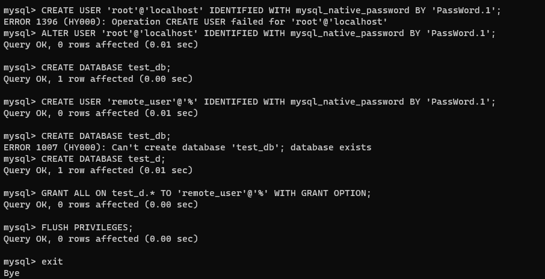
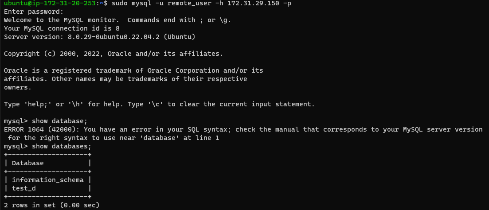

## DOCUMENTATION OF PROJECT 5

Project 5 is about understanding client architecture, to do this we make use of mysql 

Going to implement a client server architecture using mysql database system

Firstly create and configure two linux based virtual servers. done 

Now install mysql server using the command `sudo apt install mysql-server`

Now install mysql client using command `sudo apt install mysql-client`

now configure and create database om mysql server 

Now configure MySQL server to allow connections from remote hosts using the command `sudo vi /etc/mysql/mysql.conf.d/mysqld.cnf` thsi will open mysql file, make neccesary changes abd exit the file.

To check if we are succesful try and connect to  mysql client Linux Server emotely to mysql server Database Engine without using ssh

 The image above shows that its succesful 

 ## we have deployed a fully functional MySQL Client-Server set up.

